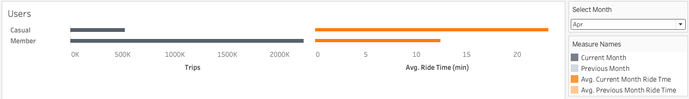
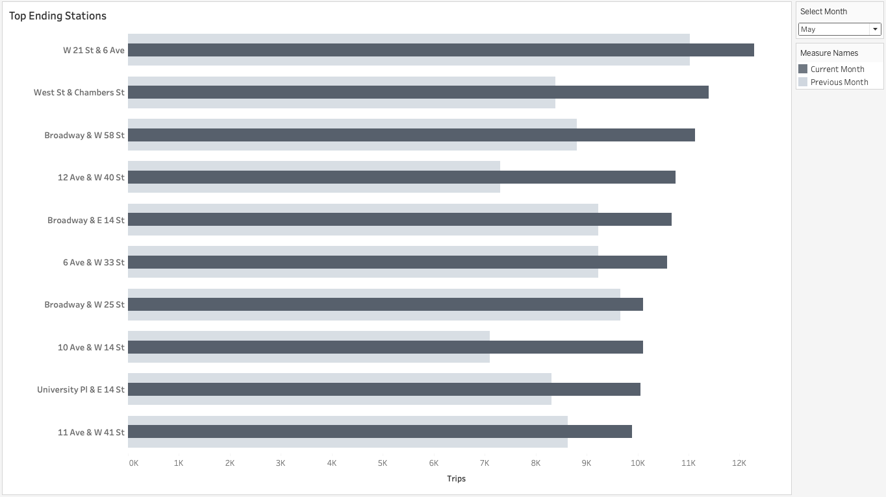

# tableau-challenge

## Overview

This project generates reports for city officials looking to publicize and improve the [New York Citi Bike](https://en.wikipedia.org/wiki/Citi_Bike) program, the largest bike sharing program in the United States.

Since 2013, the Citi Bike program has implemented a robust infrastructure for collecting data on the program's utilization. Each month, bike data is collected, organized, and made public on the [Citi Bike Data](https://www.citibikenyc.com/system-data) webpage.

However, while the data has been regularly updated, a dashboard or sophisticated reporting process has yet to be implemented. City officials have questions about the program, so the first task on the job is to build a set of data reports to provide the answers.  

Tableau Public limits data to 15 million rows.  As such, the reports and analysis in this project only include data for Q2 2023 (April, May, and June: 9,510,489 rows).

## Visualizations

[Tableau Vizzes](https://public.tableau.com/app/profile/brenda.mccourt/viz/NYCitiBike_17265594865820/Trips?publish=yes)

## Questions

1. How many trips have been recorded for each selected month in Q2 2023?
2. What are the peak days when bikes are used?
3. How have the proportions of casual users and members changed?
4. What is the average ride time for a bike trip by user type?
5. How have the proportions of classic and electric bikes changed?
6. What is the average ride time for a bike trip by bike type?
7. What are the top 10 stations for starting a journey
8. What are the top 10 stations for ending a journey?

## Analysis

Users can interact with the visualizations by selecting a month to set as the current month to compare with the previous month.

### Number of trips per month and peak days of usage

June had the most monthly trips (3,443,689) compared to April (2,742,906) and May (3,323,894).  This is an increase of 3.6% compared to May. 

May showed an increase of 21.18% from April. There is a noticeable dip in trips on May 20th, Armed Forces Day.  May 19th was Bike To Work Day which showed a 13.08% increase from the previous month, April 19th.

Overall, we see that most trips happen between the 12th and 15th day of each of the months.

### Proportions of casual users vs members and average ride times.

Overall, we see that the bike share program has significantly more users that are members versus casual users.  However, casual users tend to ride the bikes for longer periods of time.  In April, 517,819 casual users rode on average 23.04 min.  Whereas members rode on average 12.42 min.

The month of May shows the same tendency of having more members riding for fewer minutes in comparison to fewer casual users taking longer trips.

The month of June also reflects the same observations as previous months, however this is the first indication that average ride times were lower compared to the previous month, as indicated with the red circle.  Casual users rode on average for
22.25 mins, down 5.28% from 23.49 mins in May.  Member users rode on average for 12.62 mins, down 2.13% from 12.89 mins in May.

### Proportions of classic vs electric bikes and average ride times.

April showed more rides on classic bikes vs electric bikes but the bike durations showed no discernable difference (14.41 min vs 14.44 min).

May showed that electric bike rides were 15.35 mins long on average compared to 14.72 mins long for classic bikes.

June showed a dip in trip durations for both classic and electric bikes.
Overall, we see that classic bikes are consistently the more popular choice for riders compared to electric bikes.  Length of trips showed no significant differenes.

### What are the top 10 stations for starting a journey?

From  the following visualizations, we can see that W 21 St. & 6th Ave is the most popular bike station for starting a journey in April, May, and June.  This station is located in New York City’s zip code 10011 which covers parts of the Chelsea and Greenwich Village neighborhoods in Manhattan. Some notable places in this area include:

1. The High Line: An elevated park built on a former railroad track that offers beautiful views of the city, art installations, and green spaces.
2. Chelsea Market: A famous food hall and shopping mall offering a variety of gourmet food options, retail stores, and restaurants.
3.	The Rubin Museum of Art: A museum focused on the art and culture of the Himalayas and surrounding regions.
4.	Google’s NYC Headquarters: Located in the former Port Authority building at 111 Eighth Avenue, this is one of Google’s largest offices outside of California.
5.	Gagosian Gallery: One of the many high-profile art galleries in Chelsea, showcasing contemporary art.
6.	Whitney Museum of American Art: While the museum is technically located in the adjacent ZIP code, it’s just on the border and a short walk from 10011, making it a nearby cultural attraction.
7.	Chelsea Piers: A large sports and entertainment complex on the Hudson River, offering everything from ice skating to golf and fitness facilities.
8.	Chelsea Hotel (Hotel Chelsea): A historic hotel famous for being a residence for many artists, musicians, and writers over the years, including Bob Dylan, Patti Smith, and Andy Warhol.

These places make zip code 10011 one of the most vibrant and culturally rich areas in Manhattan.

April shows that the next two most popular stations are Broadway & W 25 St. and Broadway & E 14 St.  However, May and June show the next two most popular stations to be Broadway & W 58 St. and West St. & Chambers St.  It's worth noting that West St. & Chambers St. is the tenth most popular station in April.  This station covers part of the Battery Park City neighborhood in Lower Manhattan (zip code 10282). This area is known for its waterfront views and residential development, so we would see very few trips compared to May and June when the weather warms up.

The Broadway & W 58 St. station is located in zip code 10019. This area is part of the Midtown and Columbus Circle neighborhoods in Manhattan, near Central Park and many cultural landmarks such as Carnegie Hall and the Time Warner Center.

### What are the top 10 stations for ending a journey?

The top 10 ending stations show the same most popular station as # 1, W 21 St. & 6th Ave as well as the same top 10 ending as starting stations.

### Monthly Trips Dashboards

Monthly Trips Dashboards show one KPI, Total Trips, by day of the month. The KPI is broken down by Trips by User Type and Trips by Ride Type. The dashboard allows the user to select a month from Q2 2023 and set it as the current month to compare with the performance of the previous month.

Additionally, the maximum and minimum number of trips are highlighted with a blue and red dot respectively.  The total number of trips is shown below the dashboard title along with a percentage differance in performance from the previous month.

#### Trips Dashboard | April

Since April is the start of the trip data, no previous month performance is shown when the user selects April as the current month.

#### Trips Dashboard | May

Selecting May will show a light blue line chart depicting April performance.

#### Trips Dashboard | June

Selecting June will also show a light blue line chart depicting May performance.

### Station Popularity Dashboards

The Station Popularity Dashboards count the number of trips at each starting and ending station for each month, and show the top 10 and bottom 10 stations.  This allows the viewer to quickly assess the most and least used stations to start and end a trip.

#### Station Popularity | April

#### Station Popularity | May

#### Station Popularity | June

## Data

Monthly CSV files for 2023 were obtained from [Citi Bike System Data](https://citibikenyc.com/system-data).  For months with more than 1 million trips, trips data is split into multiple CSVs within the same compressed file.  The compressed file was downloaded from [2023-citibike-tripdata.zip](https://s3.amazonaws.com/tripdata/2023-citibike-tripdata.zip).

The data includes:

- Ride ID
- Rideable type
- Started at
- Ended at
- Start station name
- Start station ID
- End station name
- End station ID
- Start latitude
- Start longitude
- End latitude
- End Longitude
- Member or casual ride